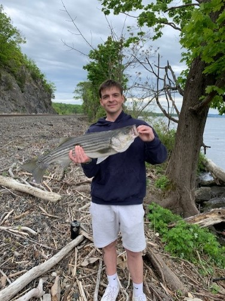

## About Me

### My Computer Expierence 
Moving on to my computer experience, I currently study computer science in school. I believe school is the tip of the computer iceberg, so I try to do a lot outside of class, especially when off from school. I also studied cybersecurity for one or two semesters in college before switching back to computer science. I took an entry-level network security course, and I took a short malware analysis course as well. Most of my time spent with cybersecurity has been spent learning about web application security. While I have not taken any true courses, I have completed a variety of labs, poked around a few bug bounty programs, and learned a lot about web app security. In terms of programming, I finished the Odin foundations course about web development with HTML, CSS, and JavaScript. I have also completed Harvard’s CS50P and CS50AI courses, along with most of CS50W. One cool project I made this summer was an Insider Trading Dashboard. I downloaded all SEC insider trading data, used Python to clean the data, and wrote it to a SQL database. I then used Plotly along with the yfinance API to create unique dynamic indicators and graphs using stock price and insider trades. I created the dashboard using a cool Python library called Dash, users can search for any public US stock in the dashboard and see the corresponding graphs.

### What I Plan To Do With The Knowledge I Gain From This Course
Although I have a good handle on fundamental web development, I have very little experience using the common frameworks we will use in this course. I look forward to getting a better idea of how many real web applications are built and deployed in the real world. I am very interested in web development both from the development side and the cyber security side. Becoming familiar with these techniques and technologies will give me better insight into the methodology used by real developers. I will use the knowledge I gain from learning about these frame works to create more robust web applications, and hopefully be more efficeient when creating them. I will also hopefully be able to create more secure applications and have a deeper understanding baout how web applications are made. I know I will use what I learn in this class in a variety of ways in my future career.  
